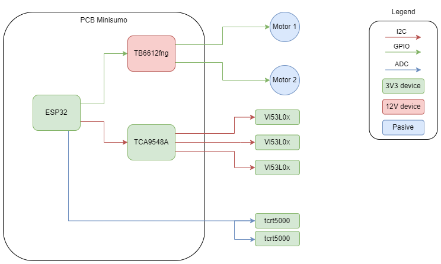

# MiniSumoDeNaranja
Minisumo para la competición OSHDEM 2023.

Hecho integramente en los directos de twitch (www.twitch.tv/labgluon)

# Hardware

## Componentes (fuera de la PCB):
- Sensores IR (TCRT5000) https://s.click.aliexpress.com/e/_DeqiwYr
- Sensores ToF (VL53L0X) https://s.click.aliexpress.com/e/_DDpGy5Z
- Motores (N20 200RPM) https://s.click.aliexpress.com/e/_DkiL8JH
- ESP32 (ESP32-WROOM-32D) https://s.click.aliexpress.com/e/_DlMmuSj

## Configuracion pines

| 1 | 2 | 3 | 4 | Modo |
|-|-|-|-|-|
| 0 | 0 | 0 | 0 | FWD  |
| 1 | 0 | 0 | 0 | RIGHT|
| 0 | 1 | 0 | 0 | LEFT |
